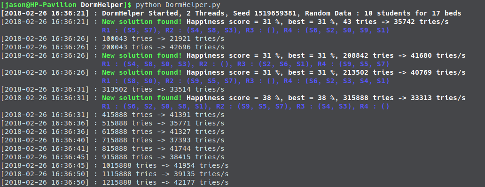
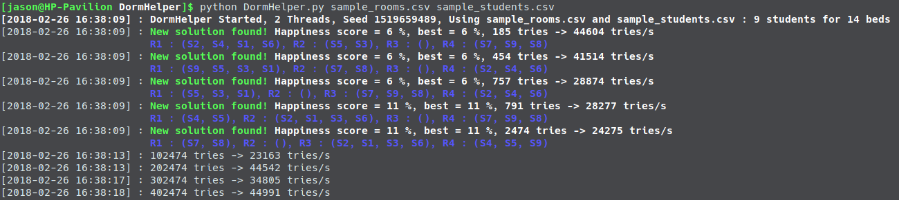

# DormHelper
Randomly affects students to rooms and select the best solution it can find.

This program was created thanks to this [Reddit post](https://www.reddit.com/r/Python/comments/7zwjzj/need_help_to_fix_this_program_bed_buddies/) from [KezzaPwNz](https://www.reddit.com/user/KezzaPwNz).

This program's goal is to assign students to bedrooms, by respecting as more as posible their requirements.

Each student can select 1, 2 or 3 friends that he wants to be with him/her on the room. 
The minimum requirement is that **everyone is with at least 1 friend**.

The program then tries to affect students in the rooms randomly until it finds a suitable solution. It evaluates the quality of this solution and then continues to look for a better one.

To evaluate the quality it calculates a happiness score based on the students' requirements :
A score of 0% means that every student is with one friend (minimum requirement) and a score of 100% means that every students share their room with all the friends the selected.

## Usage
### Help
`python DormHelper.py -h`

### Testing 
#### With random data
`python DormHelper.py`

That will launch the program with 4 rooms and 10 random students :
* Room 1 : 5 beds
* Room 2 : 3 beds
* Room 3 : 4 beds
* Room 4 : 5 beds

NB : If the program doesn't find a solution you can try to stop it and launch it again, the students are randomly generated so it's possible that there is no solution for this run.

#### With sample datas
`python DormHelper.py sample_rooms.csv sample_students.csv`

### Using real data
The program needs 2 files : one that lists the rooms and one that lists the students
#### Rooms
You can open `sample_rooms.csv` to see an exemple of the format that can read the program.
Be careful to leave the headers unchanged or the program will crash.

#### Students
You can open `sample_students.csv` to see an exemple of the format that can read the program.
Be careful to leave the headers unchanged or the program will crash.

#### Launching it
`python DormHelper.py sample_rooms.csv sample_students.csv`

### Advices / Tips
* The program will work better if every student has more than one friend. The more friends the better (no more than 3 for the moment).
* The program will work better if there are more beds than students.
* The program can decide to set a room with no students inside, so you can add more room than needed.
* The longer the program runs, the more likely it will find a solution.
* It will take a longer time to find a solution if there is more students : try to do small batches (Girls/Boys, age groups, class).
* This program use randomness, so you can lanch it simultaneously on several computers or even on the same if you have multiple cores : It will find a solution faster.
